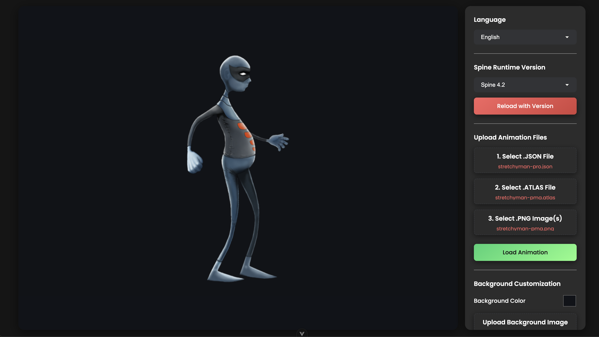

# Vue Spine Viewer
A web-based viewer for [Spine](http://esotericsoftware.com/) animations, built with Vue 3, Vite, and Phaser. This tool allows you to load and interact with your Spine animations directly in the browser, offering a range of controls for skins, animations, playback speed, and more.



## Features
-   **Load Custom Animations**: Upload your `.json`, `.atlas`, and `.png` files to view your Spine animations.
-   **Runtime Version Switching**: Easily switch between different Spine runtime versions (e.g., 4.1, 4.2) and reload the application.
-   **Multi-Track Animations**: Play multiple animations simultaneously on different tracks.
-   **Playback Control**: Pause, play, and adjust the animation speed (timescale).

## Recommended IDE Setup
-   VSCode
-   Volar (and disable Vetur if you have it installed).
-   ESLint

## Project Setup
To get the project running on your local machine, follow these steps:

1.  Clone the repository:
    ```sh
    git clone https://github.com/y1chu/vue-spine-viewer.git
    ```
2.  Navigate to the project directory:
    ```sh
    cd vue-spine-viewer
    ```
3.  Install the dependencies:
    ```sh
    npm install
    ```

## Available Scripts

### `npm run dev`

Starts the development server with hot-reloading. This is the recommended command for development.

Compiles and minifies the application for production. The build artifacts will be stored in the `dist/` directory.

### `npm run format`

Formats the source code using Prettier.

### `npm run lint`

Lints the source code using ESLint.
                                                                                    
## How to Use the Viewer
1.  (Optional) Select your desired Spine runtime version from the dropdown and click "Rsddeload with Version".
2.  Use the "Upload Animation Files" section to select your Spine `.json`, `.atlas`, and ixmage (`.png`) files.
3.  Click the "Load Animation" button.
4.  Once loaded, use the controls on the side panel to interact with your animation (change skins, play different animations, adjust speed, etc.).

## Contributing

Found a [bug](.github/ISSUE_TEMPLATE/bug_report.md) or have a [feature](.github/ISSUE_TEMPLATE/feature_request.md) request? Feel free to open an issue on GitHub. I appreciate your feedback and contributions!

## Known Issues

1. Currently does not support different skins on the same skeleton. Examples of non-working projects:
    - https://en.esotericsoftware.com/spine-examples-mix-and-match
    - https://en.esotericsoftware.com/spine-examples-chibi-stickers